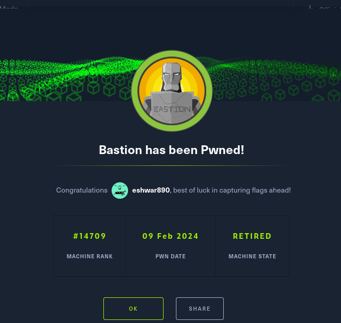
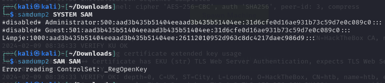

SSH, SMBClient and RPC ports are open nothing else…

tried anonymous login but failed. But listing is possible. 

with SMBClient -L \\\\10.10.10.134\\ -U Notauser/InvalidUser

Also we can do the same with the smbmap -H 10.10.10.134 -U notauser

We can see, there are read and write permissions enabled for the Backups share.

try connecting this with smbclient, 

There are .vhd files inside this share, Let us mount this share for better access to this files.

sudo mount -t cifs //10.10.10.134/Backup /mnt 

After accessing the retrieved mount, For reading the .vhd file

we can either use guestmount or qemu 

for utilizing qemu, you need to create a module using modprobe, and qemu with this module can access & emulate a real OS environment using the .vhd file.

https://www.baeldung.com/linux/qemu-from-terminal

nbd0 environment will be generated. But in my case, I have already generated nbd0, I have changed the name to nbd1.

And now we can mount to it. As new local share is available.

After mounting browsing through, we can spot a NTUSER.DAT file.

So, Files are left open. without any needed. Lets search for the SAM and SYSTEM secret files in the backups share.

find Folder-name/ -name *SYSTEM* & find Folder-name/ -name *SAM*

Got SAM and SYSTEM files? copy this files to our kali desktop.

and use samdump2 command.

After cracking the password from hashcat,

But we can’t access it with the SMB Client,

Might have access other way around, As we know the ssh port is also open for this machine. 

ssh L4mpje@10.10.10.134

.

After looking around we can spot a mremoteng application running on the machine, Which has a credentials exposing vulnerability. So, browsing to Users/L4mpje/AppData/Roaming/mremoteng there’s  confcons.xml, Which has the Administrative credentials. Searching for decryption of this password hash [mremoteng-python-script](https://github.com/kmahyyg/mremoteng-decrypt/blob/master/mremoteng_decrypt.py)

ssh login to Administrator.

# Bastion
